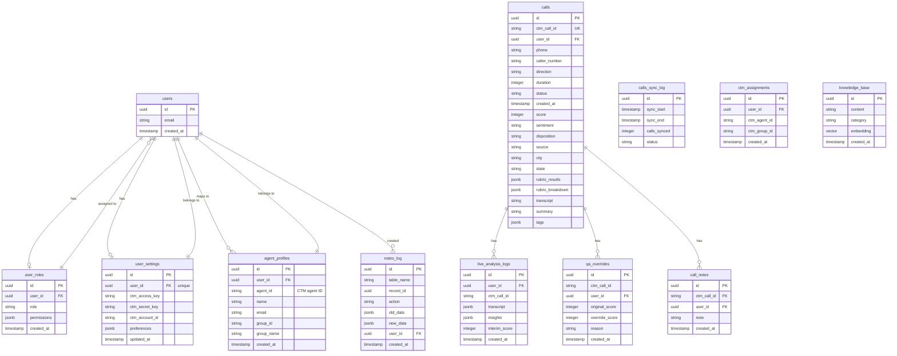
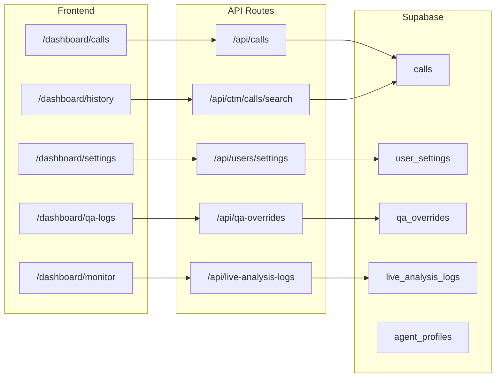

# Supabase Database Schema

## Entity Relationship Diagram

## Tables Overview

| Table | Description | Key Columns |
|-------|-------------|------------|
| `users` | Supabase auth users | id, email |
| `user_roles` | User roles & permissions | user_id, role, permissions |
| `user_settings` | Per-user preferences & CTM credentials | user_id, ctm_access_key, ctm_secret_key |
| `agent_profiles` | CTM agent mappings | user_id, agent_id, name, group_id |
| `calls` | Synced CTM call records | ctm_call_id, phone, caller_number, score, disposition |
| `calls_sync_log` | Bulk sync audit trail | sync_start, sync_end, calls_synced |
| `live_analysis_logs` | Real-time analysis data | ctm_call_id, transcript, insights, interim_score |
| `qa_overrides` | Manual QA score overrides | ctm_call_id, original_score, override_score |
| `call_notes` | Call notes | ctm_call_id, note |
| `notes_log` | Audit log for notes | table_name, record_id, action, old_data, new_data |
| `ctm_assignments` | Agent-CTM assignments | user_id, ctm_agent_id, ctm_group_id |
| `knowledge_base` | RAG embeddings for AI suggestions | content, category, embedding |

## RPC Functions

| Function | Purpose | Returns |
|---------|---------|---------|
| `handle_new_user()` | Trigger: creates user_settings on signup | - |
| `get_user_permissions(uid)` | Get user role & permissions | role, permissions JSON |
| `get_analyzed_calls_paginated(limit, offset)` | Paginated QA log entries | calls + total_count |
| `get_analyzed_calls_count()` | Count analyzed calls | integer |
| `search_calls_by_phone(phone)` | Search historical calls by phone | matching calls |

## API Routes → Database Mapping

## Key Relationships

1. **users → user_roles**: One-to-many (user has one role)
2. **users → user_settings**: One-to-one (user has one settings record)
3. **users → agent_profiles**: One-to-many (user can map to multiple CTM agents)
4. **calls → live_analysis_logs**: One-to-many (call can have multiple analysis logs)
5. **calls → qa_overrides**: One-to-one (call has at most one QA override)
6. **calls → call_notes**: One-to-many (call can have multiple notes)
